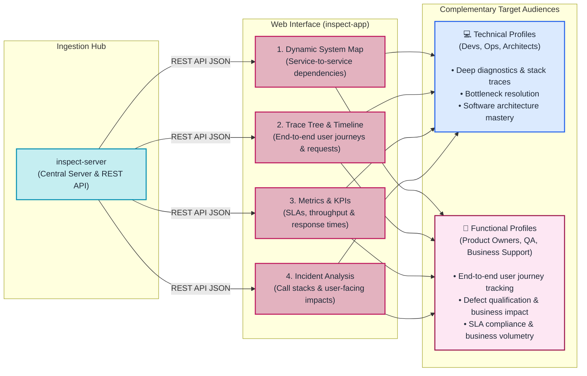

# INSPECT Application (`inspect-app`)

## Role of inspect-app in the Architecture

Storing millions of technical records in a database is only valuable if both technical teams (developers, DevOps, architects) and functional teams (Product Owners, QA, business support) can easily query, visualize, and interpret that data.

The **`inspect-app`** component (located in the `inspect-app` repository) is the front-end web application of INSPECT, developed with **Angular 16**. It queries the REST API exposed by `inspect-server` to translate telemetry metrics, traces, and dependencies into clear, interactive visual dashboards.

In INSPECT's global architecture, the "Application" pillar also represents **your monitored business applications** (your web interfaces and backend services) instrumented by the collectors.

---

## Architectural Role of inspect-app

---

## 4 Major Capabilities of inspect-app

### 1. Dynamic System Cartography (Dynamic Map)
- **Principle**: Rather than maintaining manual, static architecture diagrams that become outdated quickly, `inspect-app` analyzes live network calls recorded by collectors.
- **Visual Rendering**: The UI generates an interactive graph connecting infrastructure components:
  - Client web applications,
  - Microservices and API gateways,
  - Relational databases,
  - Third-party APIs and mail servers.
- Each link displays traffic volume and color-coded health indicators (green under normal latency, red during spikes in errors or response times).

### 2. Trace Tree & Execution Timeline
- **Principle**: When a specific request is inspected, `inspect-app` breaks down its execution into a sequential call tree and timeline:
  1. *0 ms*: HTTP request dispatched by the client browser.
  2. *45 ms*: Request received by the Java backend controller.
  3. *50 ms*: Authentication validation executed.
  4. *65 ms*: SQL query sent to the database.
  5. *1,450 ms*: Database response returned (revealing a 1.38-second database latency directly).
  6. *1,480 ms*: HTTP response returned to the client browser.
- This chronological precision pinpoints bottlenecks immediately without ambiguity.

### 3. Metric Dashboards and KPIs
- The interface consolidates essential APM (Application Performance Monitoring) indicators:
  - **Throughput & Volumetry**: requests handled per second, minute, or hour.
  - **Latency (Response Times)**: global average, as well as P95 and P99 percentiles (highlighting the slowest requests experienced by users).
  - **Error Rates and SLA Availability**: proportion of failed requests relative to total traffic.
  - **Machine Resources**: RAM usage and CPU utilization across host instances.

### 4. Error Diagnostics and Exception Tracking
- When an unhandled exception occurs in production, `inspect-app` eliminates the need to inspect raw log files across multiple servers.
- The UI centralizes error records with:
  - Exception type and root cause message,
  - Full execution stacktrace highlighting source class and line numbers,
  - Request input parameters and HTTP headers,
  - Linked user session ID.

---

## How to Integrate Your Applications

Connecting applications to the INSPECT platform is straightforward:
1. **In your Front-end (Angular)**: add the `@oneteme/inspect-ng-collector` dependency and import the module at root level.
2. **In your Back-end (Java / Spring Boot)**: add the `inspect-core` dependency in your Maven (`pom.xml`) or Gradle build file.
3. **Endpoint Configuration**: declare the URL of your `inspect-server` instance in the application configuration.

Upon startup, your applications stream runtime telemetry and automatically register in the `inspect-app` interface.

