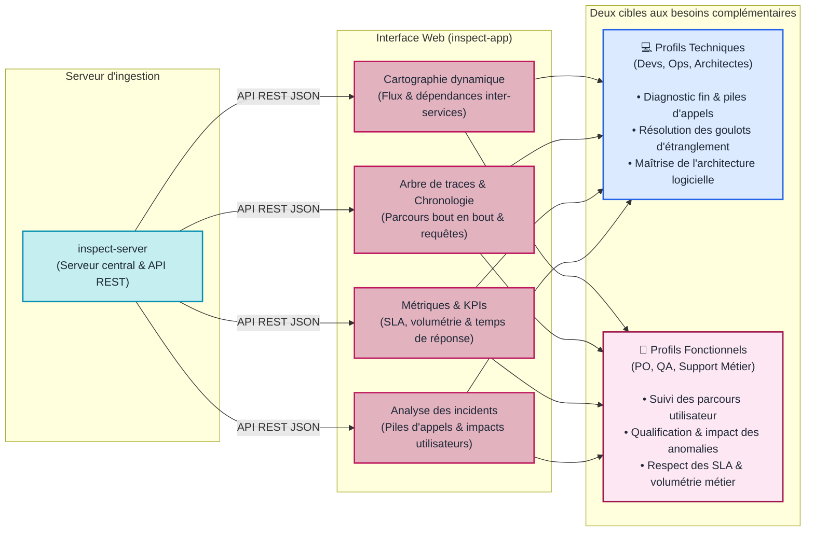

# L'Application INSPECT (`inspect-app`)

## Rôle d'inspect-app dans l'architecture

Stocker des millions d'enregistrements techniques dans une base de données ne suffit pas : pour que ces données soient exploitables aussi bien par les équipes techniques (développeurs, DevOps, architectes) que fonctionnelles (Product Owners, recetteurs/QA, support métier), il faut une interface graphique claire et interactive.

Le composant **`inspect-app`** est l'application web front-end d'INSPECT, développée avec le framework Angular. Elle interroge l'API REST de `inspect-server` pour restituer l'ensemble des métriques, des traces et des dépendances sous forme de tableaux de bord visuels (générés par les librairies de @oneteme/jquery-charts).

Dans l'architecture globale d'INSPECT, le pilier "Application" désigne également **les applications surveillées** (vos propres applications web et services back-end) que vous instrumentez à l'aide des collecteurs.

---

## Vue d'ensemble du rôle d'inspect-app

---

## Comment intégrer vos propres applications ?

L'intégration d'INSPECT dans votre système applicatif est directe :
1. **Dans votre Front-end (Angular)** : ajoutez la dépendance `@oneteme/inspect-ng-collector` et déclarez le module à la racine de l'application.
2. **Dans votre Back-end (Java / Spring Boot)** : ajoutez la dépendance `inspect-core` dans votre fichier Maven (`pom.xml`) ou Gradle.
3. **Configuration du point de contact** : renseignez l'URL de votre instance `inspect-server` dans les fichiers de configuration de vos applications.

Dès leur lancement, vos applications transmettent leurs données télémétriques et apparaissent automatiquement dans l'interface `inspect-app`.

