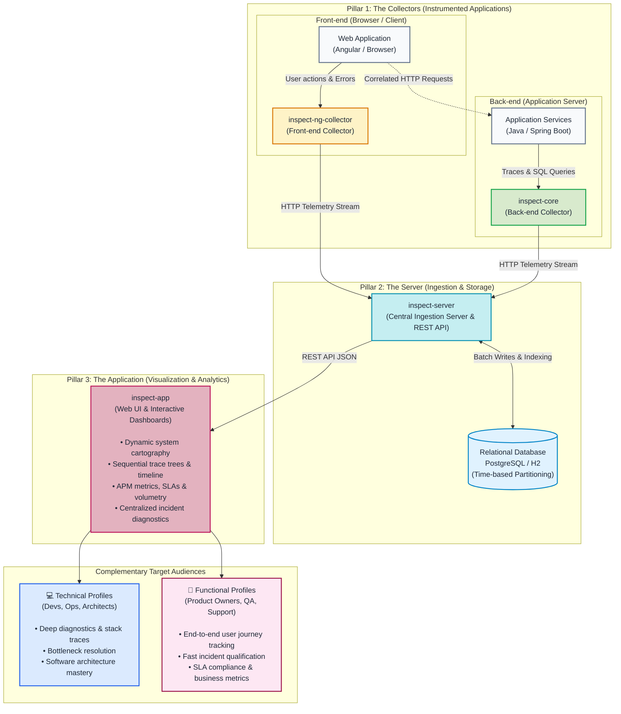

# Global Architecture of INSPECT

## Organization into 3 Pillars

INSPECT is built around **3 complementary pillars** working in harmony:

1. **The Collectors (`inspect-core` & `inspect-ng-collector`)**: Embedded telemetry libraries integrated directly into your applications (browser-side Angular and Java server-side). They capture runtime events, outgoing requests, and exceptions as they occur.
2. **The Server (`inspect-server`)**: The central ingestion and persistence engine. It ingests incoming telemetry streams, cushions peak loads through in-memory buffering, partitions data in the database for instant searches, and automatically enforces retention purges.
3. **The Application (`inspect-app` & your business applications)**: The web-based monitoring dashboard. It queries the server API to render dynamic dependency cartography, sequential trace trees, and essential APM performance indicators.

---

## INSPECT Service Interactions

