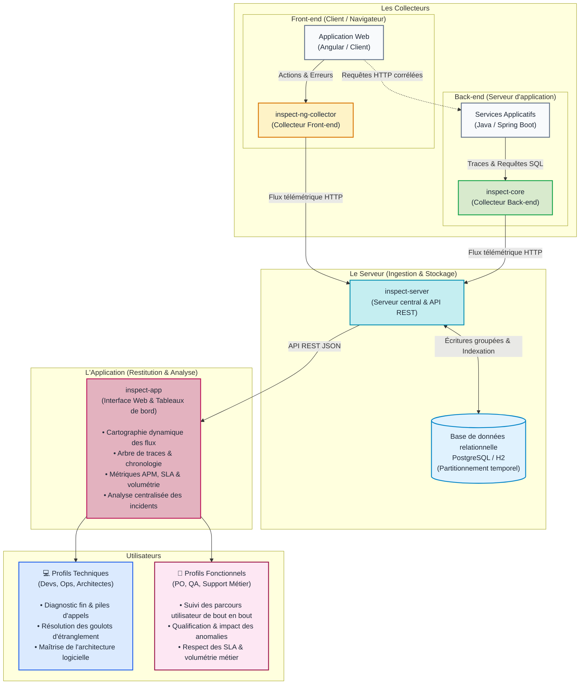

# Architecture globale d'INSPECT

## Organisation en 3 piliers

INSPECT s'organise autour de **3 piliers** :

1. **Les Collecteurs (`inspect-core` & `inspect-ng-collector`)** : Des bibliothèques intégrées directement au cœur de vos applications (côté navigateur web Angular et côté serveurs d'applications Java). Elles capturent les événements techniques, les requêtes et les erreurs au fil de l'eau.
2. **Le Serveur (`inspect-server`)** : Le serveur central d'ingestion et de persistance. Il reçoit les flux télémétriques, régule les écritures grâce à une mémoire tampon, découpe les tables par partitionnement temporel pour des recherches instantanées, et applique les politiques de purge automatique.
3. **L'Application (`inspect-app`)** : L'interface web de restitution et d'analyse. Elle interroge le serveur pour afficher la cartographie dynamique des dépendances, rejouer l'arbre d'exécution des requêtes et fournir les indicateurs nécessaires.

---

## Vue d'ensemble des flux INSPECT

