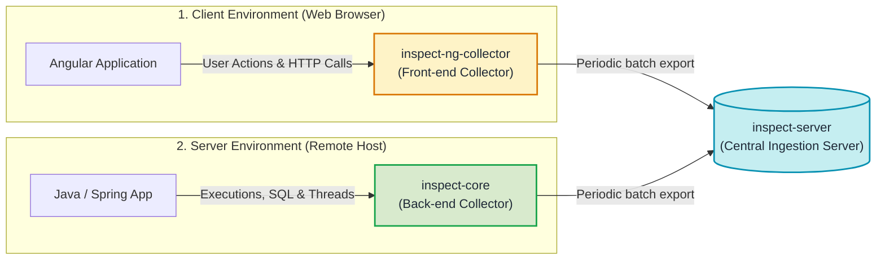

# INSPECT Collectors

## What is a Collector in INSPECT?

A **collector** (or telemetry agent) is an embedded library integrated directly into an application to monitor its runtime activity and record execution data.

The collector operates autonomously:
- It monitors system events (clicks, network requests, database queries, exceptions).
- It measures execution latencies and consumed computing resources.
- It records this information without changing your application's business logic and without blocking user interactions.

---

## Why Two Separate Collectors?

A modern web application runs in two distinct environments:
1. **The client side (Front-end)**: the code executed directly in the user's web browser (built here with Angular).
2. **The server side (Back-end)**: the code executed on a remote machine handling calculations, business rules, and database operations (built here with Java / Spring Boot).

To provide comprehensive tracing across the entire lifecycle of an operation, INSPECT provides two dedicated collection modules:

---

## 1. `inspect-ng-collector`: The Collector for Angular Applications

Located in the `inspect-ng-collector` repository, this module is installed into front-end Angular web applications.

### Role and Capabilities
Once imported into the root module of an Angular application, `inspect-ng-collector` hooks into the browser and framework runtime:

- **User interactions**: detects component clicks, form inputs, and page scrolling.
- **Navigation & routing**: captures route changes and view transitions within the single-page application.
- **Outgoing HTTP requests**: uses an HTTP interceptor to inspect every network call:
  - URL endpoint and HTTP method (GET, POST, PUT, DELETE),
  - Round-trip response time in milliseconds,
  - HTTP status codes (success 200, not found 404, server error 500),
  - Network connection failures.
- **Global exception handling**: catches unhandled JavaScript exceptions that could break the UI rendering.
- **Browser resource tracking**: monitors JavaScript heap memory to identify potential memory leaks.

### The User Session Concept
All actions performed by a user during their navigation are correlated under a unique session identifier, allowing teams to reconstruct the logical path taken through the application.

---

## 2. `inspect-core`: The Collector for Java Applications

Located in the `inspect-core` repository, this Java library instruments server-side applications, particularly those running on the Spring and Spring Boot frameworks.

### Role and Capabilities
`inspect-core` captures execution events occurring on the application server:

- **Session management**:
  - Inbound HTTP request handling from clients,
  - Background processes or batch tasks,
  - Application startup and shutdown lifecycle events.
- **External communications (Requests)**:
  - **Database access (JDBC)**: tracks executed SQL statements, query execution duration, and transaction status.
  - **Remote HTTP calls**: monitors outbound REST calls to microservices or third-party APIs.
  - **Infrastructure protocols**: measures interactions with directory services (LDAP), mail servers (SMTP), or file transfer servers (FTP/SFTP).
- **Thread Context Propagation (Thread Tracking)**:
  - In Java servers, multiple execution threads run simultaneously. When an asynchronous task moves from one thread to another, `inspect-core` transfers the tracing context across threads using `ThreadLocal` storage, preserving trace continuity.
- **Error & exception details**: captures the full error stacktrace, identifying the exact class, method, and line number where an incident occurred.
- **System metrics**: tracks process CPU utilization, JVM heap memory usage, and disk capacity.

---

## End-to-End Correlation

A key capability of this architecture is linking client-side browser actions with server-side executions:

1. A user triggers an action in the Angular application (e.g., clicking a button to load a user profile).
2. `inspect-ng-collector` generates a correlation identifier and injects it into the HTTP headers sent to the server.
3. `inspect-core` receives the request on the Java server, extracts the identifier, and correlates all subsequent operations (SQL queries, business logic, exceptions) with that same identifier.
4. Data sent to `inspect-server` shares this common reference.

This allows developers to inspect the complete execution flow, from the browser click down to the database record.

---

## Why Doesn't the Collector Slow Down the Application?

Data collection relies on two technical mechanisms to ensure minimal overhead:

1. **In-Memory Queue (Buffer)**: when an event occurs, the collector performs no blocking disk write and no immediate network call. The record is placed into an in-memory queue in a fraction of a microsecond.
2. **Asynchronous Batch Export**: an independent background dispatcher flushes the queued records periodically (e.g., every 30 seconds) in a single HTTP request to `inspect-server`. Main application threads are never interrupted.

