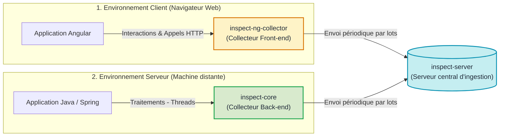

# Les Collecteurs INSPECT

## Qu'est-ce qu'un collecteur dans INSPECT ?

Un **collecteur** (ou agent de télémétrie) est une bibliothèque de code que l'on intègre directement à l'intérieur d'un programme pour mesurer son activité et enregistrer ce qui s'y passe en cours d'exécution.

Le collecteur fonctionne de manière autonome :
- Il observe les événements système (clics, requêtes réseau, requêtes en base de données, erreurs).
- Il mesure les durées d'exécution et les ressources consommées.
- Il enregistre ces informations sans modifier la logique métier de votre application et sans bloquer l'expérience utilisateur.

---

## Pourquoi deux collecteurs distincts ?

Une application web repose sur deux environnements d'exécution différents :
1. **Le côté client (Front-end)**
2. **Le côté serveur (Back-end)** 

Pour couvrir l'ensemble du cycle de vie d'un traitement, INSPECT propose deux modules de collecte spécialisés :

---

## La corrélation de bout en bout (End-to-End)

Le point fort de cette architecture est la capacité à relier ce qui se passe dans le navigateur avec ce qui s'exécute sur le serveur :

1. L'utilisateur déclenche une action dans l'application Angular (par exemple, un clic pour charger un profil).
2. `inspect-ng-collector` génère un identifiant de corrélation et l'ajoute dans les en-têtes de la requête HTTP envoyée au serveur.
3. `inspect-core` reçoit cette requête sur le serveur Java, extrait l'identifiant et lui rattache toutes les opérations internes qui suivent (les requêtes SQL en base, les calculs métier, les éventuelles erreurs).
4. Les données envoyées à `inspect-server` partagent cette référence commune.

Le système est ainsi capable de relier directement l'action côté navigateur aux opérations correspondantes en base de données.

---
