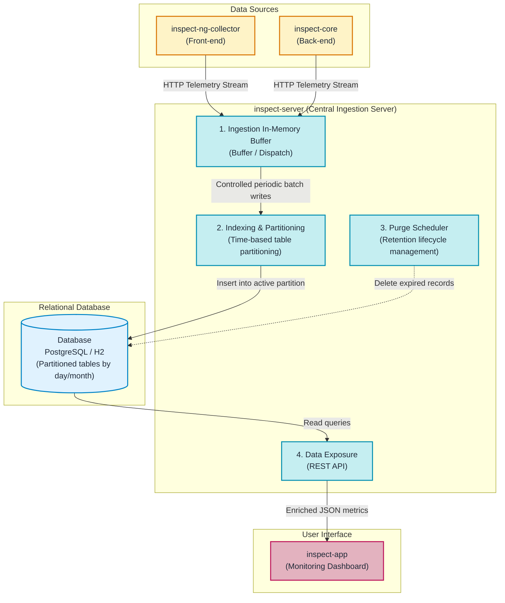

# INSPECT Server (`inspect-server`)

## Role of inspect-server in the Architecture

In a distributed software environment, multiple client applications and backend services continuously produce telemetry data. Without a centralized component to orchestrate and persist these streams, aggregating and analyzing end-to-end system behavior would not be possible.

The **`inspect-server`** component (located in the `inspect-server` repository) serves as the central ingestion, processing, and persistence hub of INSPECT. Built with Java and **Spring Boot 3.2**, it receives telemetry events from collectors, persists them in an optimized relational database, manages data retention lifecycles, and provides a REST API for data visualization.

---

## Internal Architecture Overview

---

## 4 Core Functions of inspect-server

### 1. Ingestion Flow Control (Buffer & Dispatch)
- **Technical Requirement**: During peak usage periods, thousands of telemetry events are generated per second. If the server attempted to write every event synchronously into the database upon receipt, the database would face serious I/O bottlenecks and transaction lock contention.
- **INSPECT Solution**: `inspect-server` uses an **in-memory buffer**. Incoming HTTP batches are stored immediately in RAM without blocking the senders. An internal **Dispatch** service then writes these records to the database in scheduled, consolidated batches (e.g., every 30 seconds). This smooths disk write loads and maintains high availability.

### 2. Query Optimization via Partitioning
- **Technical Requirement**: In production environments, telemetry tables quickly grow to tens of millions of rows. On a single monolithic table of this volume, database indexes expand and query execution times degrade significantly.
- **INSPECT Solution**: The server implements **automated time-based table partitioning**. High-volume tables (HTTP requests, JDBC queries, sessions) are automatically segmented into dedicated sub-tables by time period (daily or monthly). When an incident is investigated for a specific day, the database engine scans only the corresponding partition, preserving millisecond query speeds.

### 3. Automated Retention Lifecycle (Purge)
- **Technical Requirement**: Storing fine-grained trace records indefinitely exhausts disk storage and increases operational costs unnecessarily.
- **INSPECT Solution**: An automated **Purge Scheduler** runs periodically (e.g., once every night). It enforces configurable retention rules per environment (such as retaining data for 90 days in Production, but only 15 days in Development or Staging) and drops expired partitions or records safely.

### 4. Data Exposure via REST API
- `inspect-server` exposes secured REST endpoints.
- This API provides all the aggregated metrics, trace trees, service maps, and exception catalogs required by monitoring and diagnostics tools.
- It directly powers the `inspect-app` web interface.
