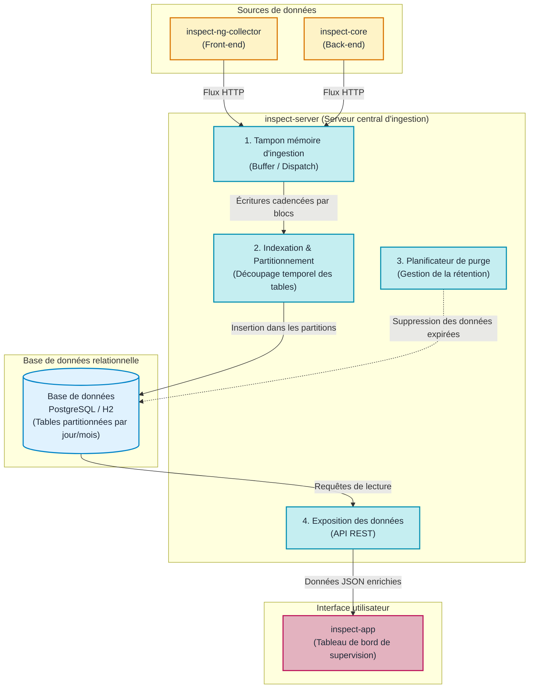

# Le Serveur INSPECT (`inspect-server`)

## Rôle d'inspect-server dans l'architecture

Dans une architecture distribuée, plusieurs applications clientes et serveurs émettent continuellement des données de télémétrie. Sans composant central pour ordonner et stocker ces flux, il serait impossible d'agréger les informations et d'en tirer des analyses globales.

Le composant **`inspect-server`** est le serveur central d'ingestion et de persistance d'INSPECT. Il reçoit les événements transmis par les collecteurs, les stocke de manière optimisée dans une base de données relationnelle, gère le cycle de vie des données et fournit une API pour la restitution.

---

## Vue d'ensemble du fonctionnement interne

